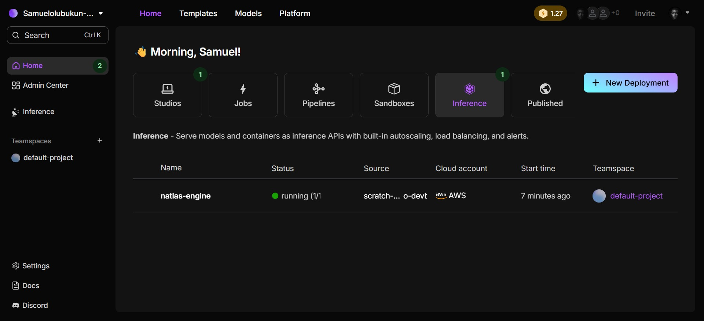
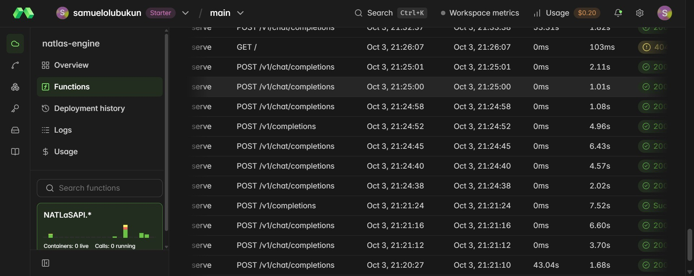
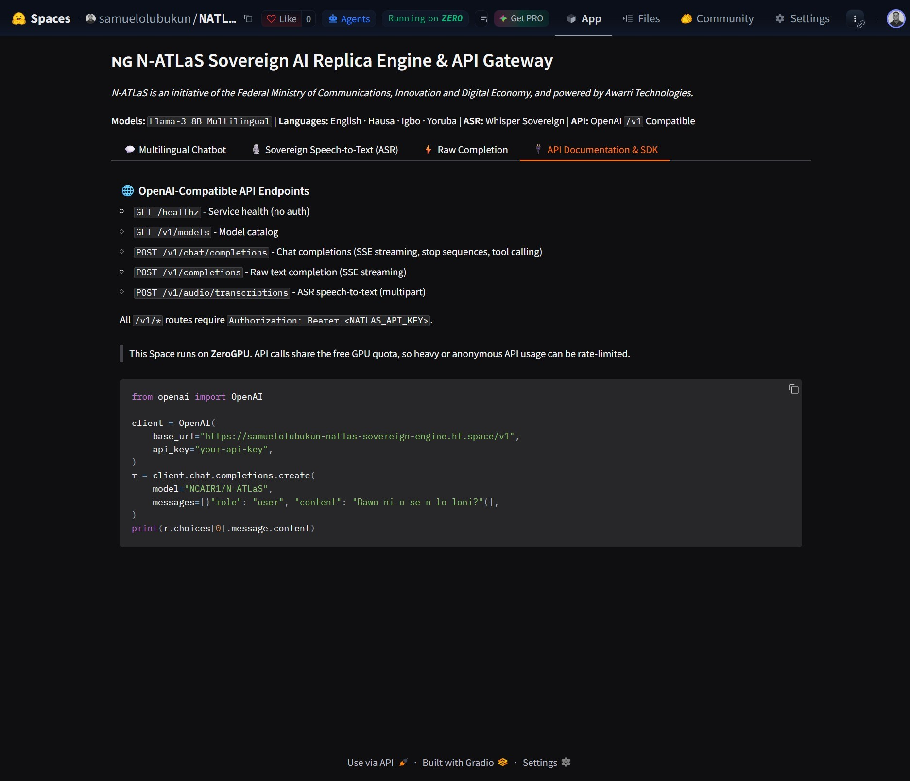

# N-ATLaS Toolkit & Production Serverless Deployment Suite

<p align="center">
  <a href="https://pypi.org/project/natlas-sdk/"></a>
  <a href="https://www.npmjs.com/package/natlas-sdk"></a>
  <a href="https://natlas-toolkit-playground.vercel.app/"></a>
  <a href="https://samolubukun.github.io/N-Atlas-Toolkit/"></a>
  <a href="https://huggingface.co/spaces/samuelolubukun/NATLaS-Sovereign-Engine"></a>
  <a href="https://github.com/samolubukun/N-Atlas-Toolkit/blob/main/LICENSE"></a>
  <a href="https://github.com/samolubukun/N-Atlas-Toolkit/actions"></a>
</p>

<p align="center">
  
  
  
  
  
  
  
  
  <a href="https://samolubukun.github.io/N-Atlas-Toolkit/"></a>
</p>


The **N-ATLaS Toolkit** is an open-source, production-ready engineering suite for Nigeria's sovereign AI initiative, spearheaded by the **National Centre for Artificial Intelligence and Robotics (NCAIR)**, the **Federal Ministry of Communications, Innovation and Digital Economy (FMCIDE)**, and **Awarri Technologies**. Built around the flagship **8.03B multilingual LLM (`NCAIR1/N-ATLaS`)** and four dedicated acoustic speech recognition models (**Yoruba, Hausa, Igbo, and Nigerian Accented English**), this monorepo provides everything developers and enterprises need to deploy, integrate, and scale indigenous AI: typed **Python** and **JavaScript/TypeScript SDKs**, high-performance **serverless cloud gateways** on Modal (`natlas_engine.py`) and Lightning AI (`natlas_engine_lightning.py`) offering unified OpenAI-compatible LLM streaming and Whisper audio transcription, containerized **Docker GPU/CPU deployments**, an interactive **Vite playground**, automated **fine-tuning and evaluation starter kits**, 7 built-in **zero-dependency Nigerian agent tools** (local gazetteer lookups, currency conversion, date formatting), and multilingual documentation across four national languages.

> 🌐 **Live Web Deployments:**
> - **Interactive Playground**: [https://natlas-toolkit-playground.vercel.app/](https://natlas-toolkit-playground.vercel.app/)
> - **Official Documentation**: [https://samolubukun.github.io/N-Atlas-Toolkit/](https://samolubukun.github.io/N-Atlas-Toolkit/)
> - **Hugging Face Sovereign Space**: [https://huggingface.co/spaces/samuelolubukun/NATLaS-Sovereign-Engine](https://huggingface.co/spaces/samuelolubukun/NATLaS-Sovereign-Engine)

```bash
# Official SDKs
pip install natlas-sdk       # Python SDK
npm install natlas-sdk       # JavaScript / TypeScript SDK
```

---

### 🎥 N-ATLaS Video Demos
<p align="center">
  <strong>🌟 Complete Tour & Playground Walkthrough [Updated]</strong><br>
  <video src="https://xxr2q8wqbj.ufs.sh/f/5VP3IsRxk7FSX2iA7Sd4tAcuLWESojvzO8rKCJiP6InGxBT5" controls="controls" muted="muted" style="max-height:480px; width:100%; border-radius: 8px; margin-bottom: 20px;"></video>
  <br>
  <strong>💬 LLM Chat & Indigenous Stream Demo</strong><br>
  <video src="https://xxr2q8wqbj.ufs.sh/f/5VP3IsRxk7FSWcGgYDXLgTfpX463sKnubzmVaRQy0O9ACqc2" controls="controls" muted="muted" style="max-height:480px; width:100%; border-radius: 8px; margin-bottom: 20px;"></video>
  <br>
  <strong>🎙️ Sovereign ASR Multi-Dialect Speech Demo</strong><br>
  <video src="https://xxr2q8wqbj.ufs.sh/f/5VP3IsRxk7FSmJ0N0a9iRwu6TNxcIC0QZ4pdBMaKerfk5zHj" controls="controls" muted="muted" style="max-height:480px; width:100%; border-radius: 8px; margin-bottom: 20px;"></video>
  <br>
  <strong>🌐 Interactive Landing Page & Overview Walkthrough</strong><br>
  <video src="https://xxr2q8wqbj.ufs.sh/f/5VP3IsRxk7FSUnZRyJjWD0rgFHScjZwCGehi4ABas5blmkyI" controls="controls" muted="muted" style="max-height:480px; width:100%; border-radius: 8px;"></video>
</p>

*(Direct Video Links: [Full Playground Walkthrough [Updated]](https://xxr2q8wqbj.ufs.sh/f/5VP3IsRxk7FSX2iA7Sd4tAcuLWESojvzO8rKCJiP6InGxBT5) · [LLM Streaming Demo](https://xxr2q8wqbj.ufs.sh/f/5VP3IsRxk7FSWcGgYDXLgTfpX463sKnubzmVaRQy0O9ACqc2) · [Sovereign ASR Audio Demo](https://xxr2q8wqbj.ufs.sh/f/5VP3IsRxk7FSmJ0N0a9iRwu6TNxcIC0QZ4pdBMaKerfk5zHj) · [Interactive Landing Page Tour](https://xxr2q8wqbj.ufs.sh/f/5VP3IsRxk7FSUnZRyJjWD0rgFHScjZwCGehi4ABas5blmkyI))*

---

## 📦 Monorepo Architecture & What's In The Repo

This repository is organized as a unified monorepo providing everything needed to build, fine-tune, deploy, and integrate sovereign Nigerian AI:

| Component / Directory | Purpose & Key Features |
| :--- | :--- |
| **[`python-sdk/`](python-sdk)** | **Official PyPI Package (`pip install natlas-sdk`)**: Fully typed synchronous & asynchronous clients, CLI (`natlas chat`, `natlas transcribe`), 7 built-in zero-auth agent tools, and MCP stdio server. |
| **[`js-sdk/`](js-sdk)** | **Official npm Package (`npm install natlas-sdk`)**: Universal TypeScript/JavaScript SDK with native fetch, SSE streaming, full types, agent tools, and executable CLI (`npx natlas`). |
| **[`playground/`](playground)** | **Interactive Web Application**: React + Vite playground UI with Chat Studio, Audio Recording & Transcription Studio, Model Catalog explorer, and live interactive documentation. |
| **[`docs/`](docs) & [`mkdocs.yml`](mkdocs.yml)** | **Developer Documentation Site**: Comprehensive documentation built with Material for MkDocs, featuring API specifications, developer tutorials, and bilingual guides (Yorùbá, Hausa, Igbo). |
| **[`finetune-starter-kit/`](finetune-starter-kit)** | **Domain Adaptation Suite**: LoRA/QLoRA and Unsloth fine-tuning recipes for adapting N-ATLaS to custom enterprise, healthcare, and educational datasets on consumer GPUs. |
| **[`cookbook/`](cookbook)** | **Production Recipes**: Copy-pasteable application templates including WhatsApp voice & text bots, banking dispute classifiers, and agent loops. |
| **[`hf_space/`](hf_space)** | **Hugging Face ZeroGPU Space ([`NATLaS-Sovereign-Engine`](https://huggingface.co/spaces/samuelolubukun/NATLaS-Sovereign-Engine))**: Turnkey Gradio Web UI and embedded `/v1/*` OpenAI endpoints for free deployment on Hugging Face Spaces. |
| **[`notebooks/`](notebooks)** | **Google Colab (`natlas_engine_colab.ipynb`)**: 1-click cloud notebook that downloads model weights, spins up the LLM engine, and exposes a public endpoint via Cloudflare Tunnel. |
| **[`natlas_engine.py`](natlas_engine.py)** | **Modal Serverless Engine**: Enterprise serverless deployment file defining container environments, GPU volume caching, FastAPI ASGI server, and WebSocket endpoints. |
| **[`natlas_engine_lightning.py`](natlas_engine_lightning.py)** | **Lightning AI Serverless Engine**: Zero-credit-card, scale-to-zero serverless deployment on NVIDIA T4 GPU with full OpenAI `/v1/chat/completions` & Whisper `/v1/audio/transcriptions`. |
| **[`deploy_lightning.sh`](deploy_lightning.sh)** | **Lightning Deployment Script**: 1-click bash script to securely push the Lightning deployment and bypass terminal formatting errors. |
| **[`docker-compose.yml`](docker-compose.yml)** | **On-Premise NVIDIA GPU Stack**: Turnkey production Docker setup unifying LLM (vLLM continuous batching) and Sovereign ASR behind an Nginx gateway on port `8000`. |
| **[`docker-compose.local.yml`](docker-compose.local.yml)** | **Local CPU & Apple Silicon Stack**: Zero-NVIDIA Docker stack for local testing on MacBooks and CPU laptops. |
| **[`Dockerfile.llm`](Dockerfile.llm) & [`Dockerfile.asr`](Dockerfile.asr)** | Dedicated Docker container definitions for the LLM and Sovereign ASR microservices. |
| **[`tests/`](tests)** | Comprehensive end-to-end integration tests and real multilingual audio samples (`hausa.mp3`, `yoruba.mp3`, `igbo.mp3`, `english.mp3`). |
| **[`scripts/`](file:///c:/Users/USER/Downloads/natlas-toolkit/scripts)** | Benchmarking and evaluation harnesses measuring WER/CER, Time to First Token (TTFT), throughput (tok/s), and latency. |
| **[`.github/workflows/`](file:///c:/Users/USER/Downloads/natlas-toolkit/.github/workflows)** | CI/CD automated workflow running multi-version matrix tests for Python, Node.js, and MkDocs site builds. |

---

## 🏛️ Sovereign Models & Architecture Catalog

The N-ATLaS ecosystem comprises one 8B large language model and four specialized Whisper speech recognition models, fine-tuned across all six geopolitical zones of Nigeria:

| Capability | Model Identifier | Base Architecture | Parameters | Training Corpus | Key Linguistic & Phonetic Strengths |
| :--- | :--- | :--- | :--- | :--- | :--- |
| **Multilingual LLM** | **[`NCAIR1/N-ATLaS`](https://huggingface.co/NCAIR1/N-ATLaS)** | Llama 3 Instruct | **8.03B** | 392M tokens (~918k instruction pairs) | Fluent code-switching, local idioms, date-aware grounding across Yoruba, Hausa, Igbo, English. |
| **Yoruba Speech (ASR)** | **[`NCAIR1/Yoruba-ASR`](https://huggingface.co/NCAIR1/Yoruba-ASR)** | Whisper Small | **244M** | 120+ hours native audio | Preserves acute/grave tone diacritics (`é`, `è`) and sub-dots (`ẹ`, `ọ`, `ṣ`). |
| **Hausa Speech (ASR)** | **[`NCAIR1/Hausa-ASR`](https://huggingface.co/NCAIR1/Hausa-ASR)** | Whisper Small | **244M** | 120+ hours native audio | Accurately models hooked implosive consonants (`ɓ`, `ɗ`, `ƙ`) and glottal stops. |
| **Igbo Speech (ASR)** | **[`NCAIR1/Igbo-ASR`](https://huggingface.co/NCAIR1/Igbo-ASR)** | Whisper Small | **244M** | 120+ hours native audio | Sub-dot vowel harmony (`ị`, `ọ`, `ụ`) and complex nasal compounds (`ṅ`, `nw`, `ny`). |
| **Nigerian English (ASR)** | **[`NCAIR1/NigerianAccentedEnglish`](https://huggingface.co/NCAIR1/NigerianAccentedEnglish)** | Whisper Small | **244M** | 120+ hours native audio | West African pitch, syllable-timed stress patterns, and Nigerian accented English pronunciation. |

---

## 🔑 Gated Model Access & Hugging Face Token Setup

> [!IMPORTANT]
> **`NCAIR1/N-ATLaS` is a gated model on the Hugging Face Hub.**
> To download model weights for private deployment (Modal, Docker, Colab, or local in-process inference), you must complete the one-time access verification:

1. **Request Access on Hugging Face**:
   - Visit the official model page: **[huggingface.co/NCAIR1/N-ATLaS](https://huggingface.co/NCAIR1/N-ATLaS)**
   - Click **"Agree and access repository"** to accept the sovereign terms (developed under the Nigerian Languages AI Initiative by FMCIDE & Awarri Technologies).
   - Access is granted automatically upon submitting the form.

2. **Generate a Read Token**:
   - Navigate to **[huggingface.co/settings/tokens](https://huggingface.co/settings/tokens)** and generate an Access Token with `Read` permissions.

3. **Configure Your Environment**:
   ```bash
   # Set in terminal or your project's .env file:
   export HF_TOKEN="hf_xxxxxxxxxxxxxxxxxxxxxxxxxxxxxxxxx"
   # Or alternatively:
   export HUGGING_FACE_HUB_TOKEN="hf_xxxxxxxxxxxxxxxxxxxxxxxxxxxxxxxxx"
   ```

4. **When Deploying on Modal**:
   ```bash
   # Create the Modal Secret containing your Hugging Face Token:
   modal secret create hf-token HF_TOKEN="hf_xxxxxxxxxxxxxxxxxxxxxxxxx"

   # Create the Modal Secret for your API Authentication:
   modal secret create natlas-secrets NATLAS_API_KEY="your-secure-api-key"
   ```

*(Note: The four Sovereign Whisper ASR speech models (`Yoruba-ASR`, `Hausa-ASR`, `Igbo-ASR`, and `NigerianAccentedEnglish`) are publicly accessible and do not require gated approval).*

---

## 🚀 How to Deploy: Four Supported Deployment Targets

Deploy N-ATLaS across cloud serverless, on-premise containers, or zero-cost GPU instances:

```text
┌────────────────────────────────────────────────────────────────────────────────────────────────────────────────────────┐
│                                              N-ATLaS DEPLOYMENT SPECTRUM                                               │
├──────────────────────────┬──────────────────────────┬──────────────────────────┬───────────────────┬───────────────────┤
│ 1. Modal Cloud           │ 2. Lightning AI          │ 3. Docker GPU / On-Prem  │ 4. Apple Sil./CPU │ 5. Google Colab   │
│ • NVIDIA A10G Serverless │ • NVIDIA T4 Serverless   │ • Turnkey Docker Compose │ • docker-compose  │ • 1-Click Jupyter │
│ • Scale-to-Zero Keepwarm │ • Free Tier (No CC req.) │ • vLLM Continuous Batch  │ • Zero NVIDIA req │ • Free T4 GPU     │
│ • Unified LLM + ASR API  │ • Scale-to-Zero Auto     │ • Nginx Reverse Proxy    │ • Local CPU/Mac   │ • Cloudflare Tun. │
└──────────────────────────┴──────────────────────────┴──────────────────────────┴───────────────────┴───────────────────┘
```

1. **Modal Cloud Serverless (Unified Production)**:
   - **Step 1: Sign up & Claim $30/month Free Tier**:
     - Create an account at **[modal.com](https://modal.com/)**.
     - Add a payment method under **Settings → Billing** to activate the **$30/mo free compute tier** (Modal will not charge you unless you exceed $30).
   - **Step 2: Install & Authenticate Modal CLI**:
     ```bash
     pip install modal
     modal setup
     ```
   - **Step 3: Configure Cloud Secrets**:
     ```bash
     modal secret create hf-token HF_TOKEN="hf_xxxxxxxxxxxxxxxxxxxxxxxxx"
     modal secret create natlas-secrets NATLAS_API_KEY="your-secure-api-key"
     ```
   - **Step 4: Deploy Engine**:
     ```bash
     modal deploy natlas_engine.py
     ```
   - **Unified API Base URL**: `https://<workspace>--natlas-engine-natlasapi-serve.modal.run/v1`
   - Scales to zero after 300s of inactivity; pre-caches ~16GB weights on persistent volume.
2. **Lightning AI Serverless (Zero-Credit-Card Free Tier)**:
   - Command:
     ```bash
     pip install lightning-sdk
     lightning login
     lightning deployment create \
       --name natlas-engine \
       --studio scratch-studio-devbox \
       --command "uvicorn natlas_engine_lightning:app --host 0.0.0.0 --port 8000" \
       --machine lit-t4-1 \
       --min-replicas 0 \
       --max-replicas 1 \
       --ports 8000
     ```
   - Scale-to-zero serverless deployment on NVIDIA T4 GPU. Spins up automatically on incoming requests, charges $0 while idle.
3. **On-Premise Dedicated GPU Server (Docker Compose)**:
   - Command: `docker compose up -d --build`
   - Unified Endpoint: `http://localhost:8000/v1`
   - High-throughput vLLM PagedAttention engine + Faster-Whisper behind unified Nginx proxy.
4. **Local Apple Silicon & CPU Fallback**:
   - Command: `docker compose -f docker-compose.local.yml up -d --build`
   - Runs inference on MacBooks (M1/M2/M3/M4) or standard laptops without discrete NVIDIA GPUs.
5. **Google Colab (Zero-Setup GPU Engine)**:
   - Open [`notebooks/natlas_engine_colab.ipynb`](notebooks/natlas_engine_colab.ipynb) to launch on a free cloud GPU with a secure public Cloudflare Tunnel URL.

## 🚀 Live Production Deployment

<p align="center">
  
</p>

The engine is deployed, live, and fully operational on Modal:

- **Modal API URL**: `https://<workspace>--natlas-engine-natlasapi-serve.modal.run` (NVIDIA A10G)
- **Lightning AI API URL**: `https://<deployment-id>.cloudspaces.litng.ai` (NVIDIA T4 Serverless)
- **Hardware Acceleration**: NVIDIA A10G / NVIDIA T4
- **Engine**: PyTorch / Transformers bfloat16 + SDPA with native vLLM Continuous Batching support
- **Scale-to-Zero Economics**: Automatically scales to 0 replicas during idle periods (0 credits billed when idle)
- **Volume Caching**: Persistent model weight caching preserving weights across container lifecycles

---

## ⚡ Live API Endpoints

### Deployment Architecture & Base URLs

N-ATLaS supports five production deployment targets:

1. **Lightning AI (Free Tier Serverless)**:
   - **Unified API Base URL**: `https://<deployment-id>.cloudspaces.litng.ai/v1`
   - Scale-to-zero NVIDIA T4 GPU container serving OpenAI-compliant chat completions and Whisper ASR.
   - Code & requirements: [`natlas_engine_lightning.py`](natlas_engine_lightning.py) and [`requirements-lightning.txt`](requirements-lightning.txt).

   <p align="center">
     
     
   </p>

2. **Modal Cloud Deployment (Unified Serverless Engine)**:
   - **Unified API Base URL**: `https://<workspace>--natlas-engine-natlasapi-serve.modal.run/v1`
   - Serves both the 8.03B Multilingual LLM and all 4 Sovereign Whisper ASR models from a single unified serverless endpoint.
   - Dedicated NVIDIA A10G (24GB VRAM) with continuous batching and sub-second cold starts.

   <p align="center">
     
     
   </p>

3. **Hugging Face Spaces (ZeroGPU Free Tier)**:
   - **Gradio Web UI + API**: `https://<workspace>-natlas-sovereign-engine.hf.space/v1`
   - ZeroGPU hardware acceleration, zero infrastructure cost, native `/v1/*` OpenAI endpoints.
   - Code & setup instructions located in [`hf_space/`](hf_space).

   <p align="center">
     
     <br>
     
     
   </p>

4. **Google Colab Notebook (Zero-Setup GPU Engine)**:
   - Run in 1 click via [`notebooks/natlas_engine_colab.ipynb`](notebooks/natlas_engine_colab.ipynb).
   - Serves the LLM and creates a secure public URL via Cloudflare Tunnel.

5. **Local / On-Premise Docker Gateway (100% Unified)**:
   - `http://localhost:8000/v1` (Nginx reverse-proxy gateway unifying both LLM and ASR).

| Method | Endpoint | Service | Description | Auth Header |
| :--- | :--- | :--- | :--- | :--- |
| `GET` | `/healthz` | Both | Container health, active GPU, and engine state | *None (Public)* |
| `GET` | `/v1/models` | LLM | OpenAI-compatible model catalog discovery | `Bearer <API_KEY>` |
| `POST` | `/v1/chat/completions` | LLM | Standard OpenAI chat (supports SSE streaming, tools, and function calling) | `Bearer <API_KEY>` |
| `POST` | `/v1/completions` | LLM | Raw prompt text completion | `Bearer <API_KEY>` |
| `POST` | `/v1/audio/transcriptions` | ASR | OpenAI-compliant Sovereign ASR speech-to-text with word alignment | `Bearer <API_KEY>` |

---

## 💻 Quickstart: Drop-In OpenAI SDK Usage

The deployed endpoint is a drop-in replacement for OpenAI:

```python
import os
from openai import OpenAI

# Initialize client pointing to your live Modal endpoint
client = OpenAI(
    base_url=os.environ.get("NATLAS_BASE_URL", "https://<workspace>--natlas-engine-natlasapi-serve.modal.run/v1"),
    api_key=os.environ.get("NATLAS_API_KEY", "<YOUR_NATLAS_API_KEY>"),
)

# 1. Chat Completion (Multilingual)
response = client.chat.completions.create(
    model="NCAIR1/N-ATLaS",
    messages=[
        {"role": "user", "content": "Sannu! Ka rubuta gajeren jawabi game da fasaha a Najeriya."}
    ],
    temperature=0.7,
    max_tokens=200,
)
print(response.choices[0].message.content)

# 2. Server-Sent Events (SSE) Streaming
stream = client.chat.completions.create(
    model="NCAIR1/N-ATLaS",
    messages=[
        {"role": "user", "content": "Explain why indigenous African language AI is essential."}
    ],
    stream=True,
)
for chunk in stream:
    print(chunk.choices[0].delta.content or "", end="", flush=True)

# 3. Agentic Tool Calling (OpenAI Spec)
tools = [
    {
        "type": "function",
        "function": {
            "name": "get_fx_rate",
            "description": "Fetch official Central Bank of Nigeria (CBN) exchange rates",
            "parameters": {
                "type": "object",
                "properties": {"currency": {"type": "string"}},
                "required": ["currency"],
            },
        },
    }
]
tool_resp = client.chat.completions.create(
    model="NCAIR1/N-ATLaS",
    messages=[{"role": "user", "content": "How much is 100 USD in Naira right now?"}],
    tools=tools,
    tool_choice="auto",
)
print(tool_resp.choices[0].message.tool_calls)
```

---

## 🐍 Official Python SDK (`pip install natlas-sdk`)

The Python SDK (`natlas-sdk`) provides typed synchronous and asynchronous clients, built-in cultural system prompts, word-level ASR, and zero-auth agent tools:

```python
import natlas
from natlas import tools

client = natlas.Client()

# 1. Chat with Indigenous Cultural System Presets (YO, HA, IG, EN)
response = client.chat([
    natlas.system_prompt(natlas.YO),
    {"role": "user", "content": "Bawo ni nkan? Se alaye lori AI ni soki."}
])
print(response.message.content)

# 2. Real-Time Streaming
for chunk in client.chat([{"role": "user", "content": "Explain AI in Hausa"}], stream=True):
    print(chunk.message.content, end="", flush=True)

# 3. Zero-Auth Built-in Agent Tools (Offline & Live)
tools.nigeria_gazetteer("Lagos")       # Offline 36 states + FCT + 774 LGAs
tools.math_eval("50000 * 0.075")       # Safe AST math evaluation
tools.fx_rates("USD", "NGN")           # Live FX rates via open.er-api.com
```

---

## 🟨 Official JavaScript / TypeScript SDK (`npm install natlas-sdk`)

The universal JS/TS SDK (`natlas-sdk`) works across Node.js (>= 18), Bun, Deno, Next.js, and modern browsers:

```typescript
import { NatlasClient, systemPrompt, HA } from "natlas-sdk";
import { nigeriaGazetteer, fxRates } from "natlas-sdk/tools";

const client = new NatlasClient();

// 1. Chat & Streaming
const res = await client.chat([
  systemPrompt(HA),
  { role: "user", content: "Sannu! Ka ba ni labari game da Kano." }
]);
console.log(res.message.content);

// 2. Zero-Auth Agent Tools
nigeriaGazetteer("Kano");              // Offline instant LGA lookup
await fxRates("USD", "NGN");          // Live FX rate
```

---

## 🌍 Multilingual Prompting & Translation via Chat

Perform culturally aligned translations or localized tasks using direct prompting with N-ATLaS chat completions:

```bash
curl -X POST "https://<workspace>--natlas-engine-natlasapi-serve.modal.run/v1/chat/completions" \
  -H "Authorization: Bearer $NATLAS_API_KEY" \
  -H "Content-Type: application/json" \
  -d '{
    "model": "NCAIR1/N-ATLaS",
    "messages": [
      {
        "role": "system",
        "content": "You are a professional Yoruba translator. Translate English text accurately with proper tone and diacritics."
      },
      {
        "role": "user",
        "content": "Translate to Yoruba: Education is the most powerful tool which you can use to change the world."
      }
    ],
    "temperature": 0.3
  }'
```

---

## 🎙️ Sovereign Nigerian Speech Recognition (ASR) & STT

The toolkit natively incorporates the four official sovereign **Whisper Small (244M)** speech models trained across all 6 geopolitical zones of Nigeria:

- **Hausa**: `NCAIR1/Hausa-ASR` (120+ hours training data)
- **Igbo**: `NCAIR1/Igbo-ASR` (120+ hours training data)
- **Nigerian Accented English**: `NCAIR1/NigerianAccentedEnglish` (120+ hours training data)
- **Yoruba**: `NCAIR1/Yoruba-ASR` (120+ hours training data)

### 1. OpenAI-Compliant Batch Transcriptions (`POST /v1/audio/transcriptions`)

```python
import os
import natlas

# Reads NATLAS_BASE_URL (unified for both LLM and ASR) and NATLAS_API_KEY from environment
client = natlas.Client(
    base_url=os.environ.get("NATLAS_BASE_URL", "https://<workspace>--natlas-engine-natlasapi-serve.modal.run/v1"),
    api_key=os.environ.get("NATLAS_API_KEY", "<YOUR_API_KEY>"),
)

with open("speech_yoruba.wav", "rb") as audio:
    transcription = client.audio.transcriptions.create(
        file=audio,
        model="NCAIR1/Yoruba-ASR",
        timestamp_granularities=["word"],  # Millisecond word-level timestamps
    )

print(transcription.text)
```

### 2. ASR Verification & Benchmark Test Suite (`tests/`)

The repository includes ready-to-run verification scripts and audio samples covering all 4 Nigerian languages:

```bash
# 1. Real-World E2E Integration Tests (Full Stack: Chat, Streaming, ASR, Agent Tools)
python tests/e2e_python.py
node tests/e2e_js.mjs

# 2. Batch ASR Transcription Benchmark (evaluates accuracy against ground truth)
python tests/test_asr_samples.py
```

* Audio test assets are organized in [`tests/audio/`](tests/audio) (`english.mp3`, `hausa.mp3`, `igbo.mp3`, `yoruba.mp3`).
* Evaluates transcription against ground truth with word-level timestamps and duration metadata.

---

## 🏢 Private On-Premise & Local Deployment Guide

For enterprise, banking, healthcare, or government environments requiring **100% on-premises data privacy**:

### Option 1: High-Throughput Dedicated GPU Server (NVIDIA / Predator / Cloud)
Self-host the entire N-ATLaS ecosystem (LLM + Sovereign ASR) on any internal GPU server using the included [`docker-compose.yml`](docker-compose.yml):

```bash
# Ensure HF_TOKEN and NATLAS_API_KEY are configured in your environment
docker compose up -d --build
```

### Option 2: Apple Silicon (M1/M2/M3/M4) & Standard CPU Laptops
For local developer testing on MacBooks or laptops without an NVIDIA GPU, use the lightweight local compose stack:

```bash
# Runs with zero NVIDIA requirements (Apple Metal / CPU support)
docker compose -f docker-compose.local.yml up -d --build
```

**Single Unified Gateway on Port `8000` (Both Profiles)**:
- **Interactive Swagger Docs**: `http://localhost:8000/docs` (LLM & Chat) & `http://localhost:8000/docs/asr` (Sovereign ASR)
- **Chat & Completions**: `POST http://localhost:8000/v1/chat/completions`
- **Sovereign Speech-to-Text**: `POST http://localhost:8000/v1/audio/transcriptions`
- **Real-Time Streaming STT**: `WSS ws://localhost:8000/v1/audio/transcriptions/streaming`

Connect using the Python SDK with a single client:
```python
import os
import natlas

client = natlas.Client(
    host="http://localhost:8000",
    api_key=os.environ.get("NATLAS_API_KEY", "<YOUR_API_KEY>"),
)

# 1. Chat Completion
response = client.chat([{"role": "user", "content": "Sannu!"}])
print(response.message.content)

# 2. Sovereign Audio Transcription
with open("speech_hausa.wav", "rb") as audio:
    result = client.audio.transcriptions.create(
        file=audio,
        model="NCAIR1/Hausa-ASR"
    )
print(result.text)
```

### Option 3: In-Process Local Python Execution (Zero-Server Prototyping)
Run inference directly inside your Python process on your local GPU/workstation:

```bash
# Install local dependencies
pip install "natlas-sdk[local]"

# Run interactive local chat runner
python run_local.py
```

Or via code:
```python
import natlas

client = natlas.Client(mode="local")
response = client.chat([{"role": "user", "content": "Báwo ni!"}])
print(response.message.content)
```

---

---

## 🔄 Re-Deploying or Updating

To update code or rebuild container images on Modal:

```powershell
modal deploy natlas_engine.py
```

---

## 🏛️ License & Attribution

Model weights and license terms are governed by [Awarri Technologies and NCAIR/NITDA](https://huggingface.co/NCAIR1/N-ATLaS).  
Attribution: *"N-ATLaS is an initiative of the Federal Ministry of Communications, Innovation and Digital Economy, and powered by Awarri Technologies."*
