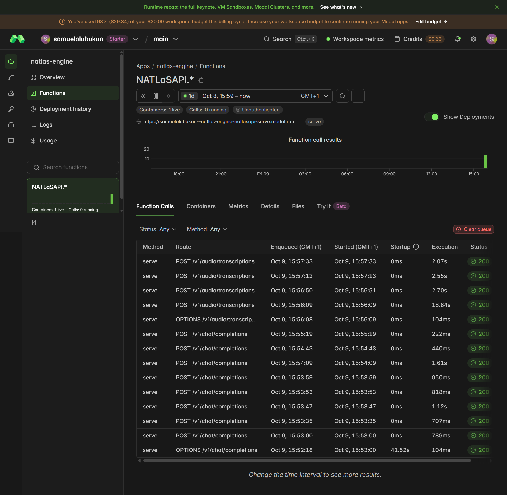
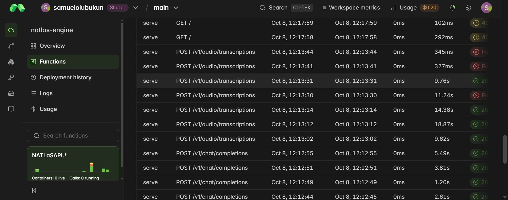
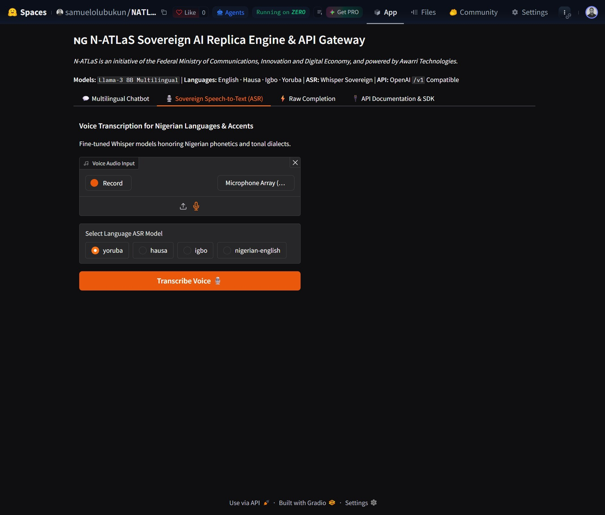
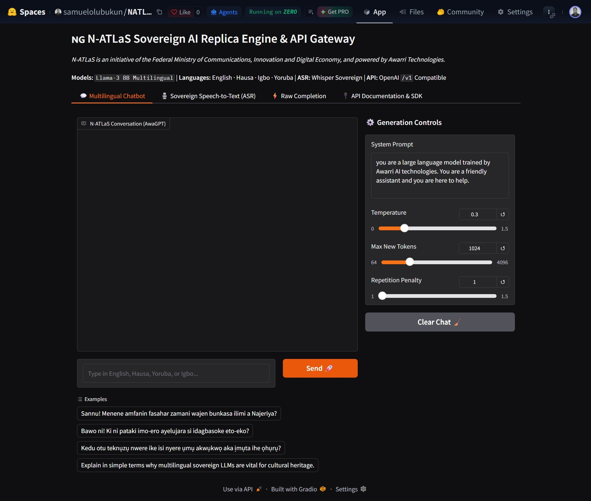
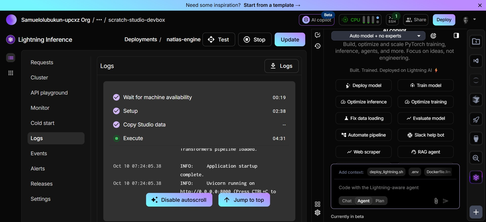

# N-ATLaS Toolkit & Production Developer Documentation

Welcome to the developer documentation for **N-ATLaS (NCAIR1/N-ATLaS)**, Nigeria's sovereign multilingual Large Language Model and Speech AI ecosystem.

!!! note "Sovereign Attribution"
    **N-ATLaS is an initiative of the Federal Ministry of Communications, Innovation and Digital Economy, and powered by Awarri Technologies.**

---

### 🎥 Watch N-ATLaS in Action
<p align="center">
  <strong>🌟 Complete Tour & Playground Walkthrough [Updated]</strong><br>
  <video src="https://xxr2q8wqbj.ufs.sh/f/5VP3IsRxk7FSS1VU1lWOWuF5jsvYkEQACcqhN7Blgo38fGm6" controls="controls" muted="muted" style="max-height:480px; width:100%; border-radius: 8px; margin-bottom: 20px;"></video>
  <br>
  <strong>💬 LLM Chat & Indigenous Stream Demo</strong><br>
  <video src="https://xxr2q8wqbj.ufs.sh/f/5VP3IsRxk7FSWcGgYDXLgTfpX463sKnubzmVaRQy0O9ACqc2" controls="controls" muted="muted" style="max-height:480px; width:100%; border-radius: 8px; margin-bottom: 20px;"></video>
  <br>
  <strong>🎙️ Sovereign ASR Multi-Dialect Speech Demo</strong><br>
  <video src="https://xxr2q8wqbj.ufs.sh/f/5VP3IsRxk7FSmJ0N0a9iRwu6TNxcIC0QZ4pdBMaKerfk5zHj" controls="controls" muted="muted" style="max-height:480px; width:100%; border-radius: 8px; margin-bottom: 20px;"></video>
  <br>
  <strong>🌐 Interactive Landing Page & Overview Walkthrough</strong><br>
  <video src="https://xxr2q8wqbj.ufs.sh/f/5VP3IsRxk7FSUnZRyJjWD0rgFHScjZwCGehi4ABas5blmkyI" controls="controls" muted="muted" style="max-height:480px; width:100%; border-radius: 8px;"></video>
</p>

*(Direct Video Links: [Full Playground Walkthrough [Updated]](https://xxr2q8wqbj.ufs.sh/f/5VP3IsRxk7FSS1VU1lWOWuF5jsvYkEQACcqhN7Blgo38fGm6) · [LLM Streaming Demo](https://xxr2q8wqbj.ufs.sh/f/5VP3IsRxk7FSWcGgYDXLgTfpX463sKnubzmVaRQy0O9ACqc2) · [Sovereign ASR Audio Demo](https://xxr2q8wqbj.ufs.sh/f/5VP3IsRxk7FSmJ0N0a9iRwu6TNxcIC0QZ4pdBMaKerfk5zHj) · [Interactive Landing Page Tour](https://xxr2q8wqbj.ufs.sh/f/5VP3IsRxk7FSUnZRyJjWD0rgFHScjZwCGehi4ABas5blmkyI))*

---

## ⚡ Deployment Infrastructure & Cloud Gateways

N-ATLaS runs across high-performance sovereign cloud runtimes with zero-downtime scaling:

### 1. Modal Cloud Unified Serverless Engine
Full-stack serverless deployment running the 8.03B Multilingual LLM alongside 4 Whisper ASR models on NVIDIA A10G (24GB VRAM) with continuous batching.

<p align="center">
  
</p>

<div style="display: flex; gap: 12px; margin-bottom: 24px; flex-wrap: wrap;">
  
  
</div>

### 2. Hugging Face Spaces (ZeroGPU Free Tier)
Gradio interface with native `/v1/*` OpenAI-compliant API gateways hosted on ZeroGPU:

<p align="center">
  
</p>

<div style="display: flex; gap: 12px; margin-bottom: 24px; flex-wrap: wrap;">
  
  
</div>

### 3. Lightning AI (Serverless Cloudspaces)
Scale-to-zero NVIDIA T4 containerized inference runtime with unified live monitoring:

<div style="display: flex; gap: 12px; margin-bottom: 24px; flex-wrap: wrap;">
  
  
</div>

### 4. Google Colab (Zero-Setup GPU Engine)
Run the entire Sovereign Engine on free or Pro T4/A100 Google Colab instances in 1 click, exposing an OpenAI-compatible public API through Cloudflare tunnels:

- **Notebook Path**: [`notebooks/natlas_engine_colab.ipynb`](https://github.com/samolubukun/N-Atlas-Toolkit/blob/main/notebooks/natlas_engine_colab.ipynb)
- **Features**: Auto-mounts Google Drive cache, installs runtime dependencies, provisions Cloudflare secure ingress, and exposes live health and streaming endpoints.

### 5. Local & On-Premise Docker Gateway (100% Unified)
Run fully sovereign, air-gapped on-premise deployments using Docker Compose with GPU acceleration or CPU fallback:

- **Gateway URL**: `http://localhost:8000/v1`
- **Reverse Proxy**: Nginx unified reverse proxy routing chat completions to vLLM/Transformers and audio transcriptions to the Whisper ASR engine.
- **Guide**: Detailed setup and configuration in [Docker & Self-Hosting Guide](deployment/docker.md).

---

## What is N-ATLaS?

N-ATLaS is a sovereign AI suite engineered specifically for Nigerian linguistic structures, cultural idioms, accents, and tonal nuances.

```text
                               +-------------------------------------+
                               |          N-ATLaS Ecosystem          |
                               +-------------------------------------+
                                                  |
                     +----------------------------+----------------------------+
                     |                                                         |
         +-----------------------+                                 +-----------------------+
         |     Sovereign LLM     |                                 |     Sovereign ASR     |
         |    NCAIR1/N-ATLaS     |                                 |  Whisper Small (244M) |
         +-----------------------+                                 +-----------------------+
                     |                                                         |
       +-------------+-------------+                             +-------------+-------------+
       |             |             |                             |             |             |
```

---

## Key Highlights

1. **Sovereign Multilingual LLM (`NCAIR1/N-ATLaS`)**: Flagship 8.03B parameter instruction-tuned model (based on Llama 3) fine-tuned on 392M tokens (~918k instruction pairs) across Yoruba, Hausa, Igbo, and Nigerian Accented English. Fluent in indigenous idioms, localized reasoning, code-switching, and cultural context.
2. **Dual SDK Support**: First-class, fully typed [`python-sdk`](sdk/python.md) and [`js-sdk`](sdk/javascript.md) (Universal TS/JS for Node, Next.js, and Browsers).
3. **Sovereign Speech-to-Text (ASR)**: Dedicated Whisper Small (244M) models fine-tuned on 120+ hours per language:
    - **Yoruba**: `NCAIR1/Yoruba-ASR` (preserves acute/grave tone diacritics and sub-dots)
    - **Hausa**: `NCAIR1/Hausa-ASR` (hooked implosive consonants `ɓ`, `ɗ`, `ƙ`, and glottal stops)
    - **Igbo**: `NCAIR1/Igbo-ASR` (vowel harmony `ị`, `ọ`, `ụ`, and nasal compounds)
    - **Nigerian English**: `NCAIR1/NigerianAccentedEnglish` (Nigerian syllable timing and pitch)
4. **High-Accuracy Audio Transcription**: Millisecond word-level timestamps and multi-format audio support (WAV, MP3, WebM, FLAC).
5. **Flexible Deployment**:
    - **Live Modal Cloud**: Zero-server setup with scale-to-zero economics.
    - **Hugging Face Spaces**: ZeroGPU free tier with OpenAI-compliant endpoints.
    - **Lightning AI**: Containerized T4 Cloudspaces with live logs.
    - **Google Colab**: 1-click execution with secure Cloudflare ingress.
    - **Self-Hosted Docker**: 1-command Docker Compose gateway with NVIDIA vLLM or CPU fallback.

---

## Quick Navigation

- [**Installation & Quickstart**](getting-started/install.md): Get up and running in under 2 minutes.
- [**Model Catalog**](getting-started/models.md): Understand the models, datasets, and architecture.
- [**Python SDK Guide**](sdk/python.md): Synchronous, Asynchronous, and Streaming client.
- [**JavaScript / TypeScript SDK**](sdk/javascript.md): Universal client with SSE.
- [**LLM Capabilities & Chat**](llm/chat.md): Streaming conversational completions and prompt formatting.
- [**Audio Transcriptions (ASR)**](asr/transcriptions.md): Batch and voice note speech-to-text with word alignment.
- [**Docker & Self-Hosting**](deployment/docker.md): On-premises private deployment.
- [**API Reference**](api/endpoints.md): Complete REST endpoint documentation.
- [**Èdè Yorùbá (Bilingual Docs)**](yo/index.md): Ka àwọn ìwé ìtọ́ni ní èdè Yorùbá.
